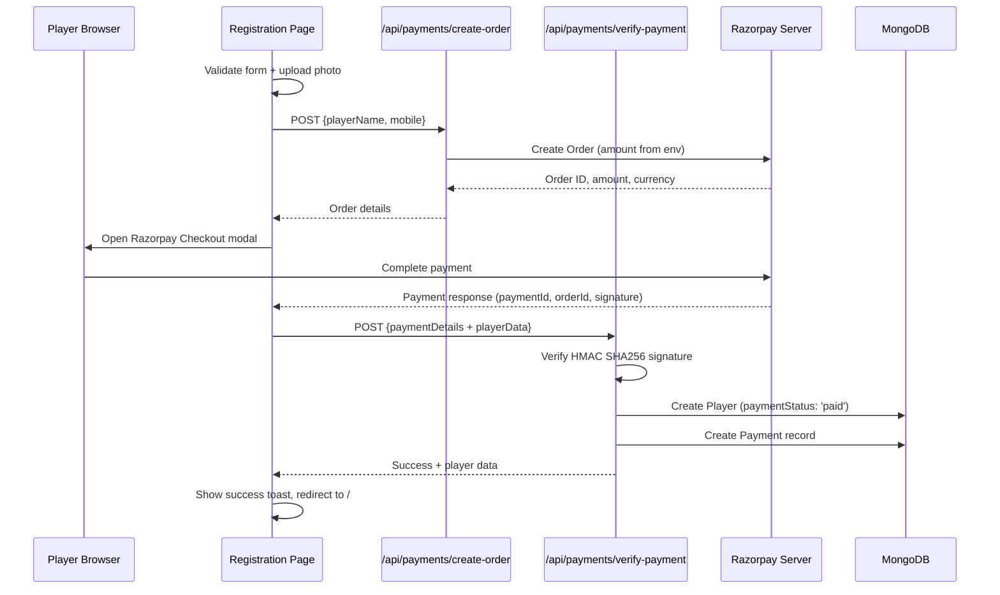
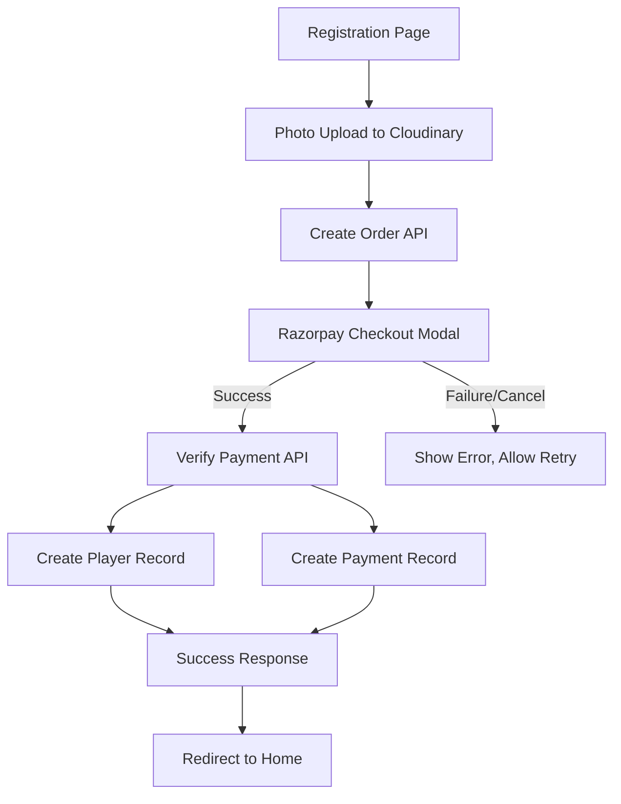

# Design Document: Razorpay Player Registration

## Overview

This design integrates Razorpay payment gateway into the existing player registration flow. The current flow (form validation → photo upload → player creation) is extended to include a payment step between photo upload and player creation: form validation → photo upload → Razorpay order creation → payment → signature verification → player creation.

The payment acts as a gate — only players who successfully pay the registration fee get their `Player` record created. This ensures the admin approval queue only contains paid registrations.

### Key Design Decisions

1. **Payment before player creation**: The Player record is only created after successful payment verification, avoiding orphaned records for unpaid registrations.
2. **Server-side amount control**: The registration fee is set via environment variable on the server, never from client input, preventing fee manipulation.
3. **Atomic verification + creation**: Payment verification and player creation happen in a single API call to prevent inconsistent states.
4. **Separate Payment model**: Payment records are stored independently from Player records, maintaining clean separation and enabling payment auditing.

## Architecture



### Component Interaction



## Components and Interfaces

### API Routes

#### POST `/api/payments/create-order`

Creates a Razorpay order for the registration fee.

**Request Body:**
```json
{
  "playerName": "string",
  "mobile": "string"
}
```

**Response (200):**
```json
{
  "success": true,
  "data": {
    "orderId": "order_xxxxx",
    "amount": 50000,
    "currency": "INR"
  }
}
```

**Error Response (500):**
```json
{
  "success": false,
  "error": "Failed to create payment order"
}
```

#### POST `/api/payments/verify-payment`

Verifies Razorpay payment signature and creates player + payment records.

**Request Body:**
```json
{
  "razorpay_order_id": "string",
  "razorpay_payment_id": "string",
  "razorpay_signature": "string",
  "playerData": { /* full player form data */ }
}
```

**Response (201):**
```json
{
  "success": true,
  "data": {
    "player": { /* player record */ },
    "payment": { /* payment record */ }
  }
}
```

**Error Response (400):**
```json
{
  "success": false,
  "error": "Payment verification failed"
}
```

### Services

#### `services/paymentService.js`

```javascript
// createRazorpayOrder(playerName, mobile) → { orderId, amount, currency }
// verifyPaymentSignature(orderId, paymentId, signature) → boolean
// createPaymentRecord(paymentData) → Payment document
```

### Frontend Changes

The registration page (`app/players/register/page.js`) will be modified to:

1. Load Razorpay checkout script dynamically on mount
2. After photo upload, call create-order API instead of directly creating the player
3. Open Razorpay Checkout modal with order details
4. On payment success, call verify-payment API with payment details + player data
5. On payment failure/cancel, show error and allow retry (form data preserved)
6. Disable submit button while payment is in progress

### Environment Variables

| Variable | Location | Purpose |
|----------|----------|---------|
| `RAZORPAY_KEY_ID` | Server + Client (`NEXT_PUBLIC_`) | Razorpay API key for checkout |
| `RAZORPAY_KEY_SECRET` | Server only | Razorpay secret for signature verification |
| `REGISTRATION_FEE_AMOUNT` | Server only | Registration fee in paise (e.g., 50000 = ₹500) |

Client-exposed variable: `NEXT_PUBLIC_RAZORPAY_KEY_ID`

## Data Models

### Payment Model (`models/Payment.js`)

```javascript
const paymentSchema = new mongoose.Schema({
  playerId: {
    type: mongoose.Schema.Types.ObjectId,
    ref: 'Player',
    required: true,
  },
  razorpayOrderId: {
    type: String,
    required: true,
    unique: true,
  },
  razorpayPaymentId: {
    type: String,
    required: true,
    unique: true,
  },
  razorpaySignature: {
    type: String,
    required: true,
  },
  amount: {
    type: Number,
    required: true,
  },
  currency: {
    type: String,
    default: 'INR',
  },
  status: {
    type: String,
    enum: ['paid', 'failed', 'refunded'],
    default: 'paid',
  },
}, {
  timestamps: true,  // provides createdAt as payment timestamp
});
```

### Player Model Changes

Add a `paymentStatus` field to the existing Player schema:

```javascript
paymentStatus: {
  type: String,
  enum: ['unpaid', 'paid'],
  default: 'unpaid',
}
```

This field is set to `'paid'` during the verify-payment flow. The admin can see this when reviewing registrations.


## Correctness Properties

*A property is a characteristic or behavior that should hold true across all valid executions of a system — essentially, a formal statement about what the system should do. Properties serve as the bridge between human-readable specifications and machine-verifiable correctness guarantees.*

### Property 1: Order amount is server-controlled

*For any* request to the create-order API, regardless of what fields the client sends in the request body (including an `amount` field), the created Razorpay order amount SHALL always equal the value of the `REGISTRATION_FEE_AMOUNT` environment variable.

**Validates: Requirements 1.1, 1.4**

### Property 2: Successful order response contains required fields

*For any* successful order creation, the API response SHALL contain a non-empty `orderId` string, a positive numeric `amount`, and a non-empty `currency` string.

**Validates: Requirements 1.2**

### Property 3: Checkout options contain player contact info

*For any* form data with a non-empty `name` and valid `mobile`, the Razorpay checkout options object constructed from that form data SHALL contain `prefill.name` equal to the player's name and `prefill.contact` equal to the player's mobile number.

**Validates: Requirements 2.4**

### Property 4: Signature verification correctness

*For any* tuple of (orderId, paymentId, secret), the signature verification function SHALL accept a signature equal to `HMAC_SHA256(orderId + "|" + paymentId, secret)` and SHALL reject any signature that does not match this computation.

**Validates: Requirements 3.2**

### Property 5: Valid payment creates player with paid status

*For any* valid payment verification (correct signature) with valid player data, the created Player record SHALL have `paymentStatus` equal to `'paid'`.

**Validates: Requirements 3.3, 5.4**

### Property 6: Invalid signature blocks player creation

*For any* invalid payment signature, the verify-payment API SHALL return an error response and SHALL NOT create a Player record in the database.

**Validates: Requirements 3.5**

### Property 7: Payment record completeness and referential integrity

*For any* successful payment verification, the created Payment record SHALL contain: `razorpayOrderId`, `razorpayPaymentId`, `razorpaySignature`, `amount` (positive number), `currency`, `createdAt` (timestamp), and a `playerId` that references the associated Player record.

**Validates: Requirements 3.4, 5.1, 5.2, 5.3**

## Error Handling

| Scenario | Handler | Behavior |
|----------|---------|----------|
| Razorpay SDK fails to load | Frontend `useEffect` | Show toast: "Payment service unavailable. Please try again later." Disable submit button. |
| Create-order API fails | Frontend `handleSubmit` | Show toast with error message. Re-enable submit button. Form data preserved. |
| Razorpay Checkout dismissed | `modal.dismiss` handler | Show toast: "Payment cancelled." Re-enable submit button. Form data preserved. |
| Payment processing error | `handler.failed` callback | Show toast with `error.description`. Re-enable submit button. Form data preserved. |
| Signature verification fails | Verify-payment API | Return 400 with error message. No DB records created. Frontend shows error toast. |
| Player creation fails after payment | Verify-payment API | Log error with payment details for manual reconciliation. Return 500. |
| MongoDB connection failure | Service layer | Throw error, caught by API route, return 500. |

### Retry Strategy

- Payment failures do NOT clear form state — the player can retry immediately
- Each retry creates a new Razorpay order (orders are cheap and expire after 30 minutes)
- No rate limiting on order creation (Razorpay handles this on their end)

### Edge Cases

- **Double submission**: Submit button is disabled during the entire payment flow (order creation → checkout → verification)
- **Browser refresh during payment**: Payment is lost, player must restart. No orphaned records since Player is only created after verification.
- **Razorpay webhook vs client callback**: This design uses client-side callback only (simpler). For production hardening, a webhook endpoint could be added later for reconciliation.

## Testing Strategy

### Unit Tests

Focus on specific examples and edge cases:

- Create-order API returns 500 when Razorpay SDK throws
- Create-order API ignores `amount` field in request body
- Verify-payment API returns 400 for empty/missing signature
- Verify-payment API returns 400 for malformed player data (validation failure)
- Payment model rejects records without required fields
- Player model accepts the new `paymentStatus` field with valid enum values

### Property-Based Tests

Use `fast-check` as the property-based testing library (JavaScript/Node.js ecosystem, well-maintained, works with any test runner).

Each property test runs a minimum of 100 iterations.

**Test Configuration:**
- Library: `fast-check`
- Runner: Jest or Vitest (whichever is configured in the project)
- Iterations: 100+ per property

**Property Test Implementations:**

1. **Feature: razorpay-player-registration, Property 1: Order amount is server-controlled**
   - Generate arbitrary request bodies with random fields including `amount`
   - Call the order creation logic
   - Assert the resulting order amount equals the configured env var value

2. **Feature: razorpay-player-registration, Property 2: Successful order response contains required fields**
   - Generate random valid player names and mobile numbers
   - Mock Razorpay to return random valid order IDs
   - Assert response always has `orderId` (non-empty string), `amount` (positive number), `currency` (non-empty string)

3. **Feature: razorpay-player-registration, Property 3: Checkout options contain player contact info**
   - Generate random non-empty names and valid mobile numbers
   - Call the function that builds Razorpay checkout options
   - Assert `prefill.name` equals input name and `prefill.contact` equals input mobile

4. **Feature: razorpay-player-registration, Property 4: Signature verification correctness**
   - Generate random orderId, paymentId, and secret strings
   - Compute expected signature as HMAC_SHA256(orderId + "|" + paymentId, secret)
   - Assert verification function returns true for correct signature
   - Generate a different random signature and assert verification returns false

5. **Feature: razorpay-player-registration, Property 5: Valid payment creates player with paid status**
   - Generate random valid player data and valid payment tuples
   - Call verify-payment logic with correct signatures
   - Assert created player has `paymentStatus === 'paid'`

6. **Feature: razorpay-player-registration, Property 6: Invalid signature blocks player creation**
   - Generate random player data and random invalid signatures
   - Call verify-payment logic
   - Assert error response and no Player record in database

7. **Feature: razorpay-player-registration, Property 7: Payment record completeness and referential integrity**
   - Generate random valid payment verifications
   - Assert Payment record contains all required fields
   - Assert `playerId` matches the created Player's `_id`

### Test File Structure

```
__tests__/
  payments/
    createOrder.test.js        # Unit + property tests for order creation
    verifyPayment.test.js      # Unit + property tests for verification
    signatureVerification.test.js  # Property tests for HMAC logic
    checkoutOptions.test.js    # Property tests for options builder
```
